# MiriStock - 미리미리 시작하세요!

**과거 데이터로 미리 해보는 주식투자 시뮬레이션**
  

## MiriStock - 개요

- 과거 주식 데이터를 기반으로 한 모의투자 시뮬레이션 서비스입니다. 해당 시점의 뉴스 기사를 제공하여 등락의 객관적인 자료를 제시하여 앞으로 예비 투자자의 판단력을 기르는 능력을 길러줍니다. 또 기업의 정보를 제공하여 재무제표 또한 중요하다는 것을 알려줍니다.
- 실제 비용부담 없이 주식투자의 전 과정을 경험할 수 있다는 장점이 있습니다. 이를 통해 적절한 매수·매도 타이밍을 잡고, 자신만의 원칙을 세울 수 있습니다.
- 과거 데이터를 통해 실시간 주식 거래를 경험함으로써 주가 흐름에 대한 이해를 할 수 있고, 거래 시스템을 체험해 볼 수 있다는 것이 장점입니다.
  

## 주요 기능

### 모의 자산을 통한 주식 시뮬레이션
- 회원 보유 주식, 관심 주식 목록과 시뮬레이션 날짜 기반 데이터를 제공
- 회원 시뮬레이션 날짜 기준 특정 종목 1개월, 6개월, 1년, 전체 주식 데이터 제공
- 전날 기준 당일 거래량, 급등주, 급락주 상위 5개 주식 종목 데이터 제공
- 2018년 1월 2일부터 2022년 12월 29일까지 국내 2689개 종목 주식데이터 제공
- 서비스 이용자는 시뮬레이션 시점을 1일, 7일 30일 이후로 설정 할 수 있다
- 서비스 이용자는 시뮬레이션 종료를 통해 거래했던 종목중 최고 수익금 3개 종목, 최고 손실금 3개 종목을 확인할 수 있다

### 모의 거래 
- 예정 체결가 설정 및 매수, 매도 예약 기능
- 과거 거래내역 매수, 매도 목록 확인
- 시뮬레이션 시간이 변동되면 해당 날짜의 주식 종가와 비교하여 거래 체결
- 매수, 매도시 임의 거래 수수료(0.05%) 반영

### 회원 주식 투자 포트폴리오
- 시뮬레이션 날짜 기반 보유 주식자산 제공
- 평균매수가, 현재가, 평균 매수가 기준 수익률 제공

### 주식 종목 검색
- 회원 시뮬레이션 날짜에 상장된 주식 종목명, 코드 검색
- 최근 조회한 주식 종목 10개 등록 및 삭제

### 특정 종목 정보 제공
- 특정 날짜, 종목에 맞는 뉴스데이터 제공
- 해당 종목 재무제표 정보 제공

### 서비스 이용가이드
- MiriStock서비스를 처음 사용하는 이용자에게 가이드 제공

### 커뮤니티
- QnA 게시판, 등록, 수정, 삭제
- 댓글 등록, 삭제
  

## 주요 기술

### Front-End
- node 16.18.0 (LTS)
- React 18.2.0
    - apexchart 3.37.0
    - react-apexcharts 1.4.0
    - axios 1.3.3
    - framer-motion 8.5.5
    - prettier 2.8.3
    - react-chartjs-2 5.2.0
    - react-router-dom 6.8.1
    - recharts 2.4.2
    - sweetalert2 11.7.1
    - zustand 4.3.3
    - mui/material 5.11.9
    - react-icon 11.10.5

### Back-End
- Java zulu 11.62.17 (LTS)
- Spring Boot 2.7.8
    - Gradle 7.6
    - Spring Security 5.7.6
    - JSONwebToken 2.13
    - actuator 2.7.8
- Spring DATA JPA
    - Hibernate 5.6.14
    - QueryDSL 5.0.0
- SpringDoc OpenAPI 1.6.14
- Lombok 1.18.22
- Jsoup 1.15.3

### Infra
- AWS EC2
- Ubuntu 22.04.1 (LTS)
- Docker 20.10.23
- Docker-compose 1.25.0
- nginx 1.18.0
- MySQL 8.0.32
- Redis 5.0.7

## Project Info

### Notion
[Notion Link](https://repeated-belt-b9c.notion.site/MiriStock-b5ea81abe5e1400ba044fc632561f3cd)
  

### 아키텍쳐 설계
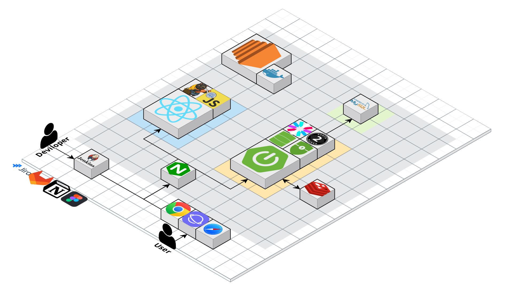
  

### ER Diagram
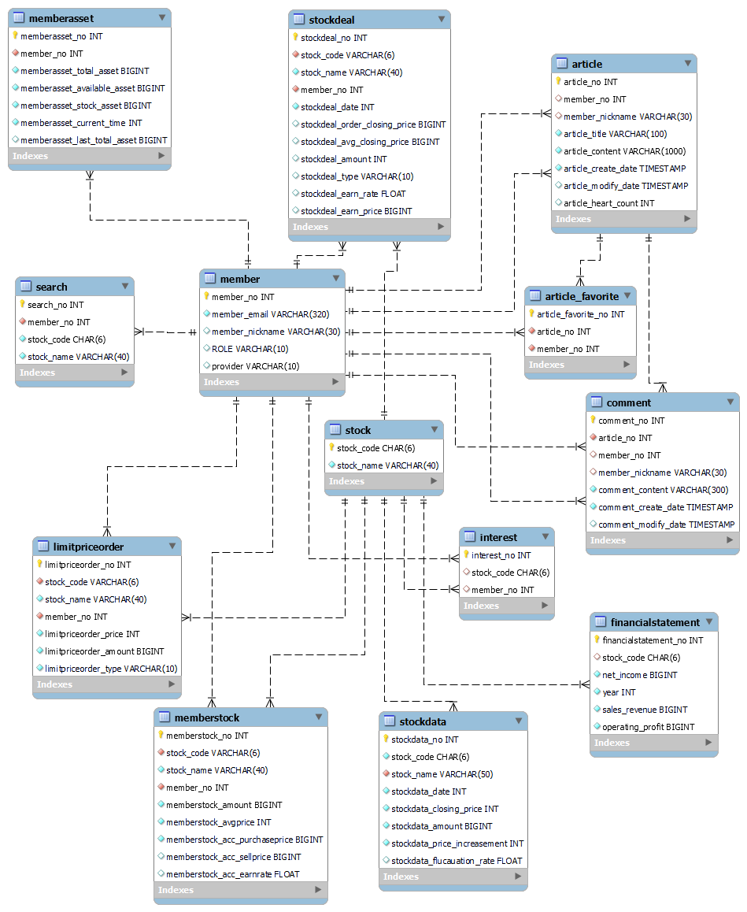
  

### Sequence Diagram

#### 결제 요청

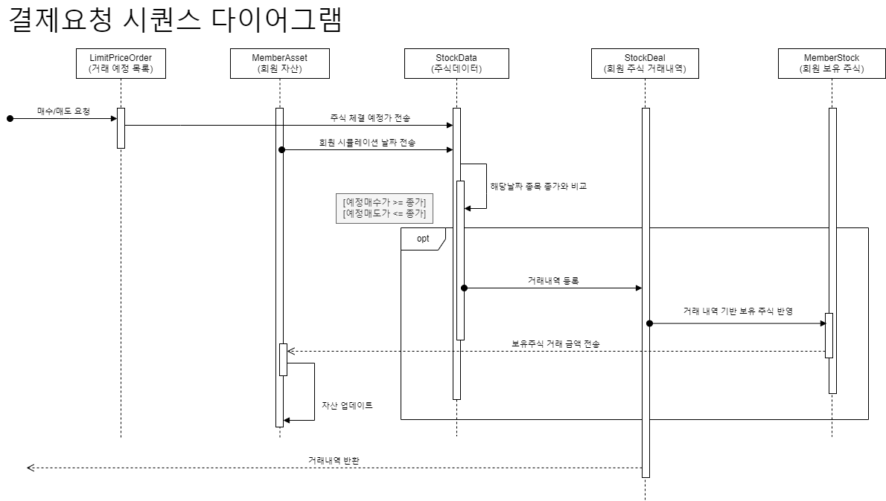

#### 시뮬레이션 날짜 변경

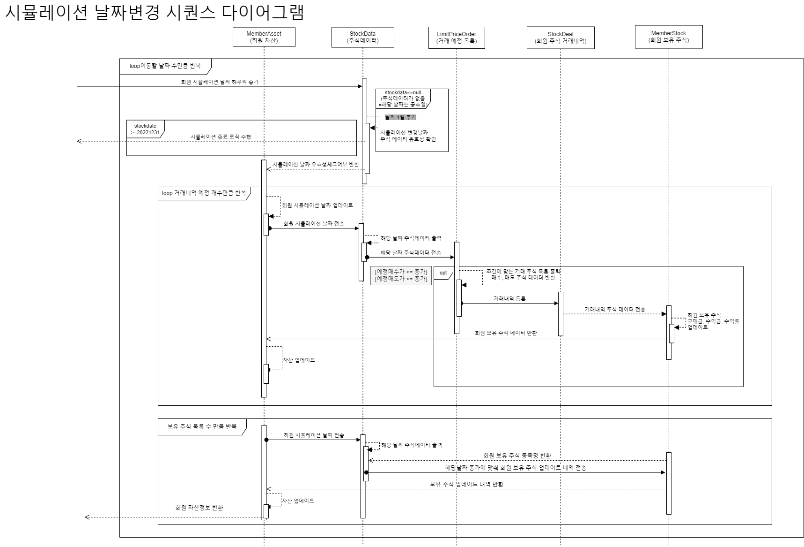

#### 시뮬레이션 종료

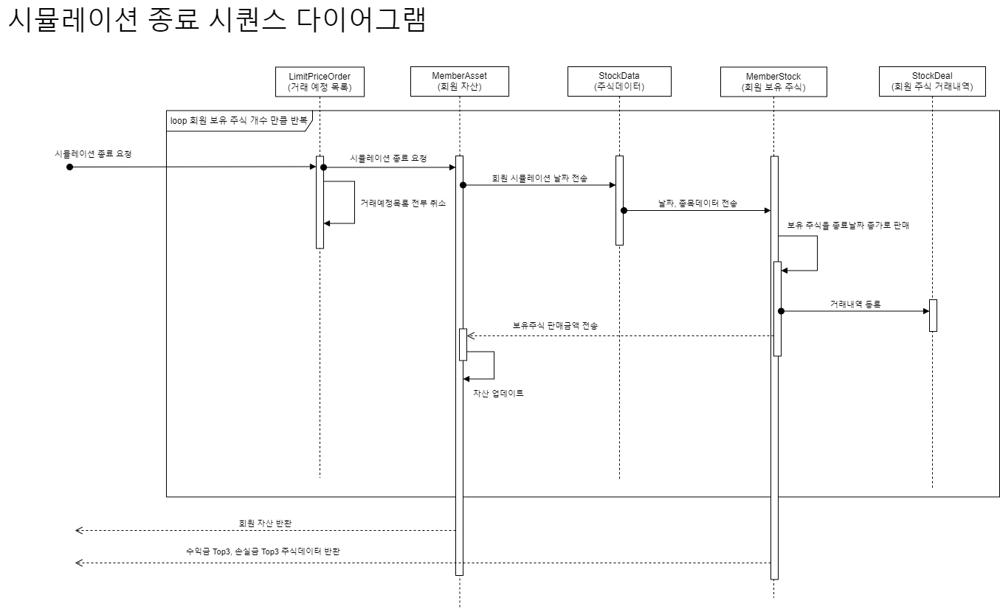

#### OAuth2.0 로그인 인증

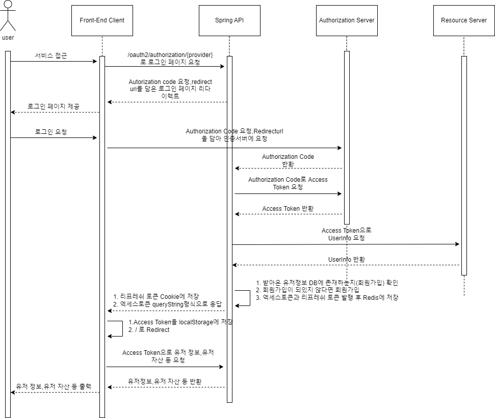

#### 토큰 만료

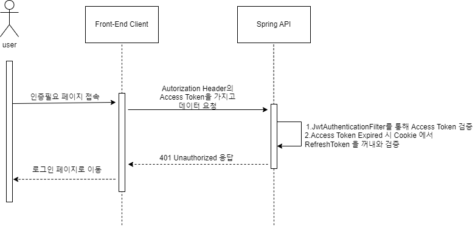

#### 토큰 재발급

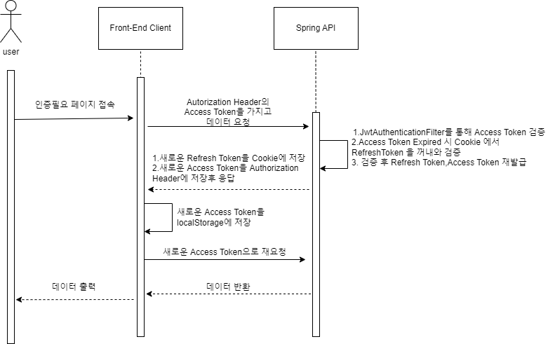

 

### API 명세서
[MiriStock - API 명세서](https://www.notion.so/API-V2-70d9611f8f3c45989caef39966cbe3c2?pvs=4)
  

### 기능명세서
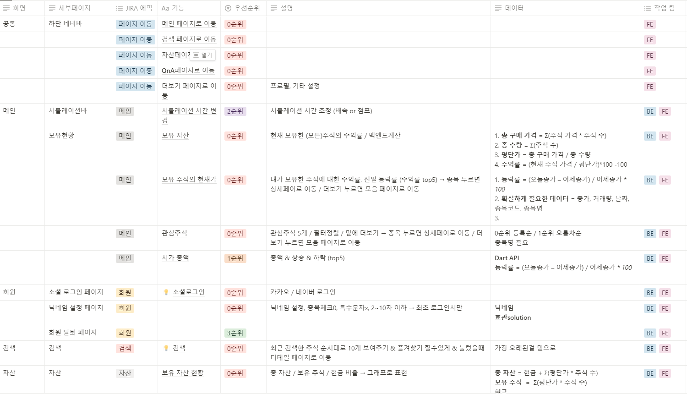

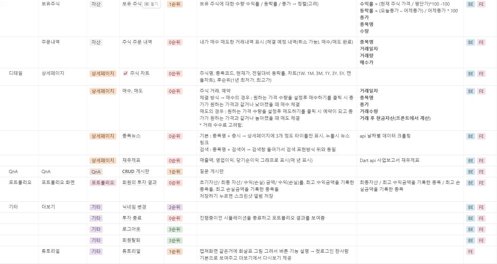

### FIGMA
[MiriStock - UX/UI](https://www.figma.com/file/rvPXOJfEVzLrgIjx0rSqzr/MiriStock---UX%2FUI?t=8CKgn8yIwhJbvyIw-1)
  

## MiriStock 서비스화면

### 회원가입, 닉네임 설정

- 카카오 소셜 로그인 기반 회원 가입입니다.
- 가입한 회원은 닉네임을 설정합니다.
- 이메일과 닉네임은 타 사용자와 중복될 수 없습니다.

 
 

### 메인화면

- 회원의 시뮬레이션 시간을 표시합니다.
- 회원의 총 보유 자산과 초기 자산 기준 수익금과 수익률을 표시합니다.
- 과거의 시간을 1일, 7일, 30일 건너뛰기 버튼을 통해 원하는 날짜로 시간을 조절할 수 있습니다.
- 메인화면에서 회원이 보유하고 있는 주식을 평가금액순으로 상위 5개 종목을 표시합니다.
- 메인화면에서 회원이 관심 주식으로 추가한 5개 종목을 표시합니다.
- 메인화면에서 시뮬레이션 시간 기준으로 거래량, 급등주, 급락주 상위 5개 종목을 표시합니다.
- 메인화면에 표시되는 주식 종목은 시뮬레이션 시간 기준 종가, 등락금, 등락률을 표시합니다.

  

### 시뮬레이션 날짜 이동

- 회원은 과거 시뮬레이션 시점을 1일, 7일, 30일 건너뛰기 버튼을 통해 날짜를 이동할 수 있습니다.
- 과거 날짜를 기준으로 주식 데이터를 이용해 회원의 보유 자산이 변동됩니다.

  

### 관심주식 목록, 추가, 삭제

- 메인화면에서 회원의 관심주식 목록 더보기 버튼을 통해 전체 목록을 확인할 수 있습니다.
- 회원의 관심주식 목록에서 항목을 삭제할 수 있습니다. 
- 주식 세부정보에서 관심주식을 추가, 삭제할 수 있습니다.

  

### 주식 종목명, 종목코드 검색

- 검색창에서 회원이 최근 검색한 주식 종목 10개를 표시합니다.
- 검색한 주식 종목을 클릭하면 최근 조회한 목록에 추가됩니다.
- 최근 조회한 목록 중 'X' 버튼을 클릭하여 최근 조회한 목록에서 삭제할 수 있습니다.

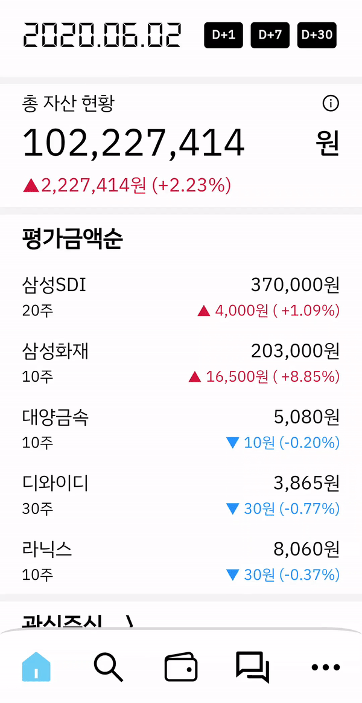
  

### 단일 종목 종가, 거래량 정보 제공

- 회원의 시뮬레이션 날짜 기준 1개월, 6개월, 1년, 전체기간(2018년 1월 2일부터) 해당 종목의 종가, 거래량 정보를 차트를 이용해 시각화 합니다.
- 그래프를 터치하여 특정 시점의 종가와 거래량을 확인할 수 있습니다.

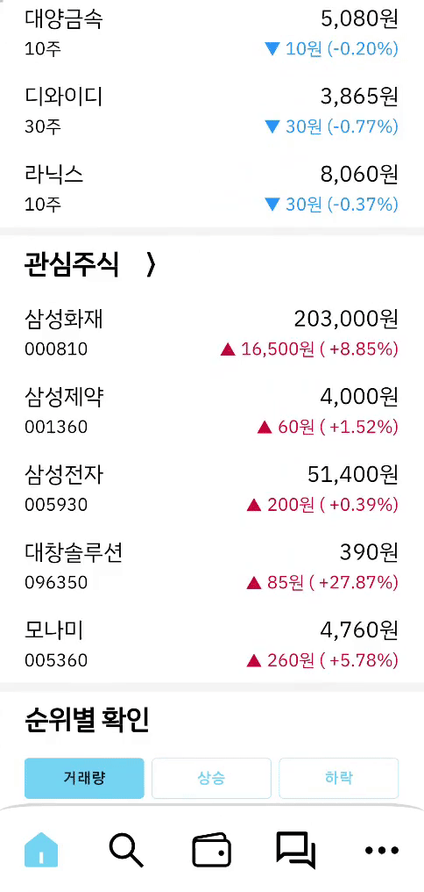
  

### 단일 종목 뉴스, 재무제표 제공

- 회원 시뮬레이션 시간 기준 단일 종목에 대한 뉴스기사를 제공합니다.
- 해당 종목의 재무제표(매출액, 영업이익, 순이익)을 2015년부터 회원 시뮬레이션 년도 기준까지 정보를 제공합니다.

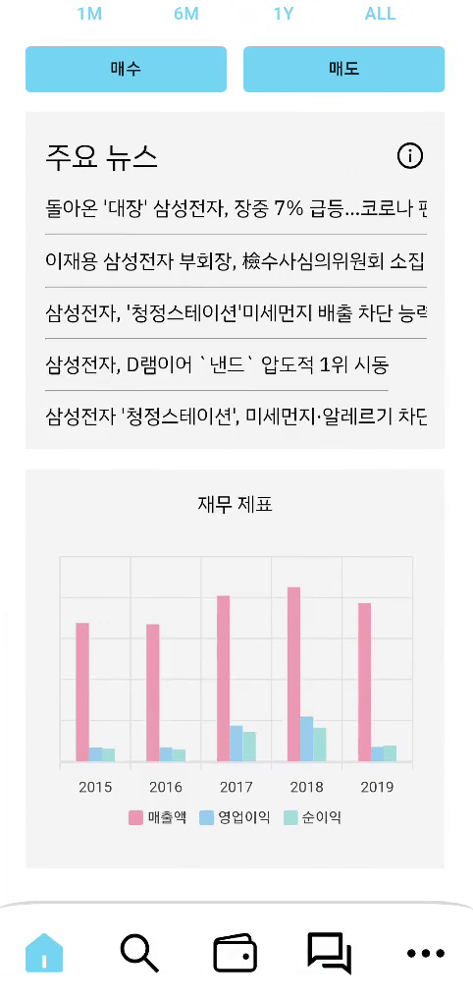
  

### 주식 매수, 매도

- 주식을 매수, 매도할 때 거래 희망가와 거래 주식수를 입력합니다.
- 매수시에 1주당 구매 희망가가 시뮬레이션날짜의 종가보다 같거나 높을 경우 구매 희망가로 거래됩니다.
- 매도시에 1주당 판매 희망가가 시뮬레이션날짜의 종가보다 같거나 낮을 경우 시뮬레이션 날짜의 종가로 거래됩니다.
- 해당 날짜의 1/3 거래량만 거래할 수 있습니다.
- 해당 날짜의 종가 +30% ~ -30% 를 거래 희망가로 체결할 수 있습니다.

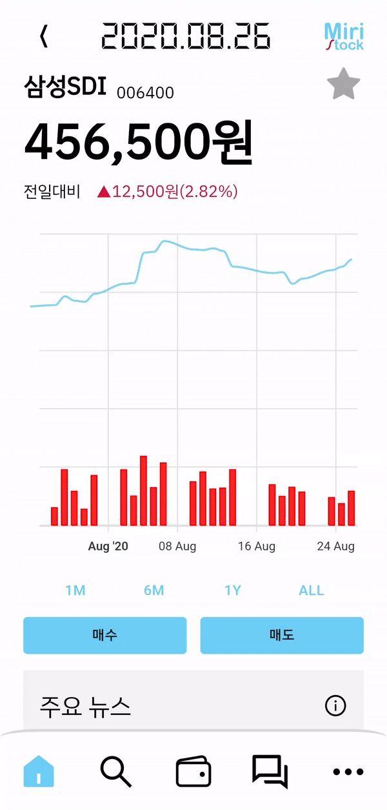

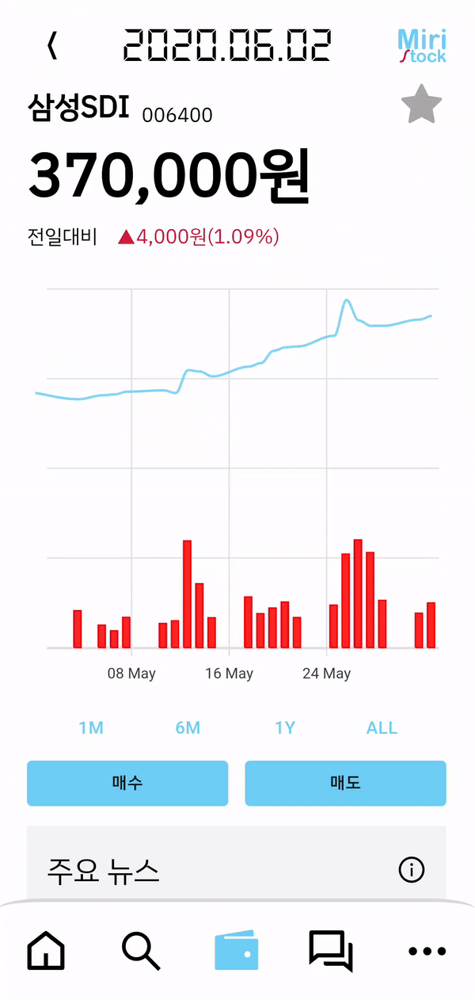
  

### 회원 자산, 보유주식 목록

- 회원의 총 자산, 주식자산, 현금자산을 보여줍니다.
- 회원의 보유주식 목록을 나타냅니다.
- 종목마다 구매량, 평균매수가와 시뮬레이션 기준 주식 데이터와 비교하여 수익률을 표시합니다.

  

### 회원 주식 거래 내역 

- 회원이 매수, 매도한 주식 목록을 최신순으로 표시합니다.

  

### 회원 주식 거래 예정 목록

- 회원이 거래할 주식 목록을 표시합니다.
- 시뮬레이션 날짜가 변경되면 주식 데이터의 종가 기준으로 매수시에 예상 거래가가 종가보다 같거나 높다면 매수합니다
- 반대로 종가 기준으로 매도시에 예상 거래가보다 종가가 같거나 낮다면 매도 합니다.

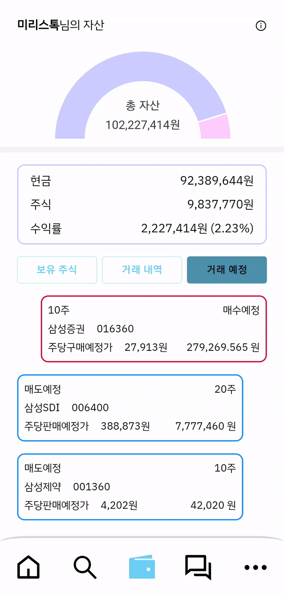
  

### 시뮬레이션 종료 및 초기화

- 시뮬레이션을 종료하면 진행상황이 초기화됩니다.
- 초기 자산 1억, 시뮬레이션 날짜가 2018년 1월 2일로 변경됩니다.
- 시뮬레이션을 종료할 때 회원이 2018년 1월 2일 시점부터 거래한 주식 목록 중 가장 수익금액이 많은 종목 3개, 손실금액이 많은 종목 3개를 표시합니다.

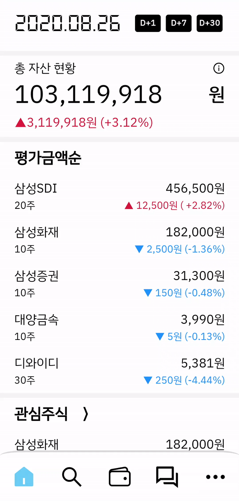
  

### QnA 게시판 작성, 수정, 삭제

- 회원은 서비스를 이용하면서 QnA게시판에 글을 작성, 수정, 삭제할 수 있습니다.

  

### QnA 게시판 댓글 작성, 삭제

- 회원은 QnA게시판 게시글에 댓글을 작성 및 삭제할 수 있습니다. 

  

### 회원탈퇴 및 로그아웃

- 회원은 카카오 소셜 로그아웃과 회원 탈퇴를 할 수 있습니다.

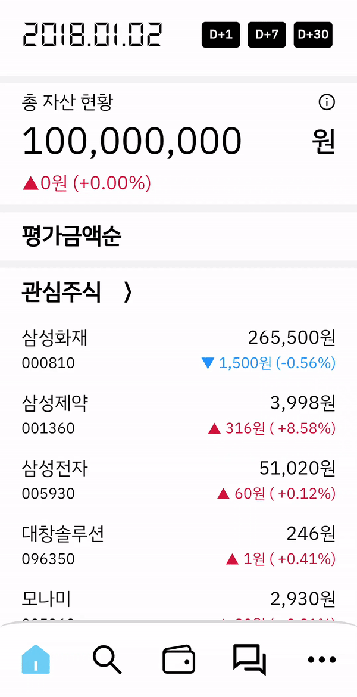
  

## Member

### 한재윤 (Team Leader, Backend)
- Database 설계, 300만개 주식 데이터 파싱 및 데이터 구축
- 넌 클러스터드 복합컬럼 인덱싱을 이용한 조회 성능 향상
- 회원 시뮬레이션 날짜 기반 보유주식, 관심주식, 평가금, 급등주, 급락주 종목 주식 데이터 제공 API구현
- 주식 예정 거래(매수, 매도) 등록, 수정, 취소 로직 개발
- 회원 시뮬레이션 날짜 변경 시(1일, 7일, 30일) 주식데이터 기반 거래 로직, 회원 자산 반영 로직 개발
- 시뮬레이션 날짜 기반 상장된 주식 종목 검색 구현
- 시뮬레이션 종료시 주식 거래내역 기반 포트폴리오 출력 구현
- 특정 날짜의 단일 종목 뉴스 데이터 출력 구현
- QnA 게시판, 댓글 조회, 등록, 수정, 삭제 구현

### 안효관 (Infra, Backend)
- OAuth 2.0 + Spring Security 활용 소셜 로그인 구현
- AWS EC2를 이용한 배포
- Jenkins를 사용한 CI/CD 구축
- Docker 기반 모놀리식 아키텍쳐 서비스 설계
- 주식 재무제표 데이터 구축

### 배상현 (Frontend Leader)
- 로그인, 검색창, 닉네임설정 디자인 설계
- 전체적인 라우터 설계 및 개발
- REST API개발
- 메인페이지, 자산현황 개발
- 전체적인 REST API 연결 및 상태관리 개발
- 배포 후 버그픽스 담당

### 이도겸 (Frontend)
- 단일 주식 종목 상세 페이지 디자인 및 개발
- 차트를 이용한 1개월, 6개월, 1년, 전체 주식 데이터 디자인 및 개발
- 뉴스 표시, 재무제표 차트 디자인 및 개발
- 주식 거래(매수, 매도) 관련 페이지 디자인 및 개발
- 거래 내역 페이지 디자인 및 개발
- 중간발표, 최종발표 담당 및 자료준비

### 유헌상 (Frontend)
- 로그인 및 유저 정보 관련 페이지 개발
- QnA게시판 디자인 및 개발
- 포트폴리오 결과 페이지 개발
- UCC 영상 촬영 및 편집

 

