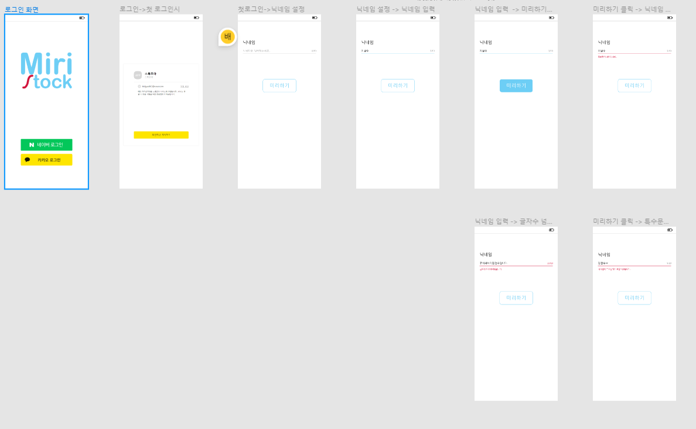
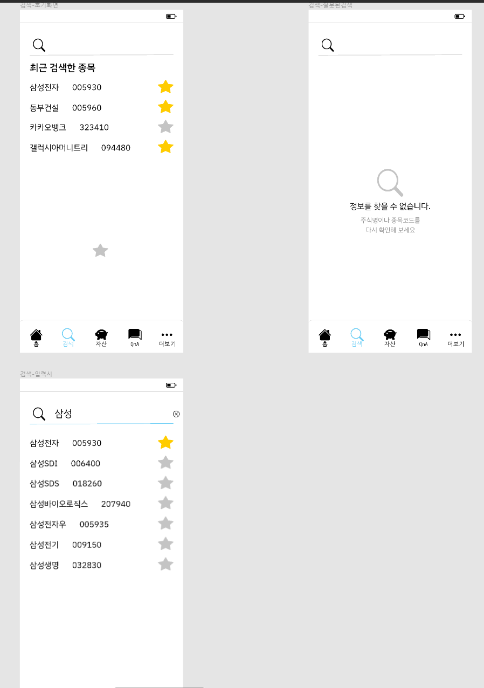

# 0116

# 카카오 로그인

# 리액트로 카카오 로그인 구현

- 인가코드만 받아서 백에서 토큰을 받아올지 or 프론트단에서 토큰까지 받아올지는 아직 회의로 정하지 않음. 근데 아마 인가코드만 받는 방식으로 진행할거같음.
- 공식문서를 위주로 공부할 예정 —> 결국 공식문서가 짱이다.

# 카카오 공식문서 정리

- 카카오 로그인은 카카오계정으로 다양한 서비스에 로그인할 수 있도록 하는 OAuth 2.0 기반의 소셜로그인 서비스이다.
- 직접 구현하지 않고도 사용자에 대한 인증과 인가를 간편하고 안전하게 처리할 수 있다.
- **인증**은 ID와 비밀번호로 사용자의 신원을 확인하는 것을 의미. 카카오쪽에서 각 사용자를 식별할 수 있는 고유한 회원번호를 제공한다.
- **인가**는 내가 사용자 개인정보와 같은 자원에 대한 접근 권한을 획득하게 해 준다. 사용자 동의를 통해 사용자 정보나 기능에 대한 접근 권한을 부여 가능
- 로그인 시 발급되는 토큰에 부여되며, 토큰을 사용해 해당 사용자에 대한 카카오 API 요청 가능. 사용자 정보를 제공받거나, 특정 기능이나 동작을 요청할 수 있음
- 애플리케이션으로 등록 → 권한 설정

### 토큰

- 토큰을 발급받음 → 액세스 토큰과 갱신하는데 쓰이는 리프레시 토큰 두 가지이단


로그인 요청을 보내면 코드 받기 요청이 카카오 서버로 간다. 인증 및 동의 요청을 다시 보내고 해당사항에 대해 동의하면 인가 코드를 발급해주고 다시 프론트단에서 인가 코드로 토큰 발급 요청을 하면 토큰을 발급해준다. 그럼 로그인이 완료 되고 토큰으로 정보 조회 및 검증 과정을 거친다.


토큰으로 사용자 정보 가져오기 요청하면 카카오서버에서 요청 검증 및 처리를 한뒤 보내준다. 그럼 보내준 정보로 서비스 회원 여부를 확인하고 신규 회원일 경우엔 회원 가입 처리를 해준다.

```javascript
const Login = (props: any) => {
  const kauthUrl=`https://kauth.kakao.com/oauth/authorize?client_id=${process.env.a9e2bc5e039f610db0317b2b799e8625}&redirect_uri=${    
https://localhost:3000/kakaologin}&response_type=code`

  return (<><a href={kauthUrl}>
                    
            </a></>
  );
};
```

일단 리다이렉트 페이지가 없어서 진행이 안되는중

리다이렉트 페이지 만든후 재도전.

```javascript
<button onClick={()=> {titleDelete(i)}}>삭제</button>
됨
<button onClick={ titleDelete(i) }>삭제</button>
매개변수없을때 가능
```

# 0117

# 카카오 로그인

- 백엔드 단에서 처리할거기때문에 프론트 할일 x

# React chart.js

```javascript
import './App.css';
import { Line } from 'react-chartjs-2';
import styled from 'styled-components';
import { Chart, registerables } from 'chart.js';
import months from './utils.js';
Chart.register(...registerables);

function App() {

  return (
    <div className="App">
      <Charts></Charts>
    </div>
  );
}

const labels = months({count: 130});
const data = {
  labels: labels,
  datasets: [{
    label : '',
    data: [65, 59, 80, 81, 56 , 20,30,40,50,60,32,50,43,15,32,54,76,89,39,94,50,19,39,69,79,39,29,38,68,48,69,79,39,65, 59, 80, 81, 56 , 20,30,40,50,60,32,50,43,15,32,54,76,89,39,94,50,19,39,69,79,39,29,38,68,48,69,79,39,65, 59, 80, 81, 56 , 20,30,40,50,60,32,50,43,15,32,54,76,89,39,94,50,19,39,69,79,39,29,38,68,48,69,79,39,65, 59, 80, 81, 56 , 20,30,40,50,60,32,50,43,15,32,54,76,89,39,94,50,19,39,69,79,39,29,38,68,48,69,79,39],
    fill: true,
    borderColor: 'rgb(255, 0, 0)',
    backgroundColor: 'rgba(255, 0, 0,0.3)',
    tension: 0.1
  }]
};

const config = {
  type: 'line',
  data: data,
};

const options = {
    plugins :  {legend : {display : false},},
    spanGaps: true,
    hitRadius : 50,
    pointRadius : 0,
    scales: {
        y: {
          // y축 스케일링
            afterDataLimits: (scale) => {
              scale.max = scale.max * 1.2;
            },
            grid : {
              display : false,
            },
        },
        x: {
          // 표 그리드  없애기
          grid : {
            display : false,
          },
          //x축 라벨없애기
          ticks : {
            display : false
          }
        },

        }

}


const Charts = () => {
  return (
    <Container>
      <Line type="line" data={data} config = {config} options = {options} />
    </Container>
  );
};

const Container = styled.div`
  width: 90vw;
  max-width: 900px;
`;


export default App;
```


결과그래프 x축 ticks 없애고 점없애고 radius늘림

추가로 공부할것 fill gradient 색깔넣기

# 0118

- 프로토타입 피그마로 제작 시작

- 글씨체 선정 
  
  - 폰트가 매우 중요하다고 생각했고 3명에서 한시간이 넘는 회의 끝에 2가지 폰트로 결정
  
  - 숫자부분이들어간 곳은 IBM 폰트로 그외는 나눔고딕코딩 폰트로하기로 결정

- 키포인트 색 선정
  
  - 기본적으로 흰바탕을 깔고 가는데 그외 버튼들이나 기타창들에 사용할 키 색깔을 고름
  
  - 여러 색들을 써봤지만 싸피를 상징하는 하늘색을 쓰기로함.

- 8-grid를 기반으로 제작. 

- 모바일 웹이 기준이라 가독성 향상을 위해 넉넉하게 사이 간격을 줬음

- 로고 제작
  
  - 미리스톡이 서비스 명이기 때문에 이를 바탕으로 로고를 제작함

- 내일부터 본격적으로 정해진 룰을 바탕으로 세세하게 제작 시작 할 예정

### React

- 컴포넌트 훅 API 등으로 폴더들을 분류해서 깔끔하게 할 필요가 있을 것 같음

- 아직 학습이 부족한게 많아 기존에 만들어진 프로젝트들의 폴더구조를 참고해서 공부중

# 0119





하루종일 피그마함...

# 1/20 ~1/24

금요일날 저녁에 내려가서 월요일날 저녁에 올라옴.

리액트 한번 다시 처음부터 공부했음


# 1/25

```javascript
import {create} from 'zustand' 

const useStore = create(set => ({
  bears: 0,
  increasePopulation: (a) => {
    console.log(a);  
    console.log(useStore.bears);
    set(state => ({ bears : state.bears + 1 }));
  },
  removeAllBears: () => {
    // set({ bears : 0 });
    set(state => ({ bears : 0 }));
  }
}))

const testStore = create(set => ({
    cart : [
        {id : 0, name : 'White and Black', count : 2},
        {id : 1, name : 'Grey Yordan', count : 1}
    ],
    increaseCount : (id) => {
      console.log(id);

    }
}))

export {useStore, testStore}
```

zustand 상태관리 공부하는중인데 단일개체는 변환이 잘됨

하지만 어레이형태 데이터는 수정이 안되고있다.

우리의 자료들 대부분 형태가 어레이에 감싸져있는데 오브젝트이기 때문에 어떻게든 활로를 찾아야한다.


# 0126
# Zustand를 써보자!

1. npm i zustand
2. store.js 생성
3. import { create } from ‘zustand’;


- state를 create한다. 타 상태관리 라이브러리와는 다르게 이게 끝임
- bears → 변수명
- increasePopulation → state 상태를 변경시킬 함수
- set은 보통 두가지 방법으로 사용함

```jsx
set({ bears : 0 });
set(state => ({ bears : 0 }));
```

우리는 무조건 아래방식으로 set쓸예정

## 단일 변수들은 위와같은 방법으로 변경하면 됨

## 하지만 우리가 받는 데이터들은 대부분 어레이속 오브젝트 형식일거라 생각

## 위와 같은 방식으로는 단일개체값만 변경이 됨


# 하지만 cart배열안에 첫번째 오브젝트의 count값을 바꾸고 싶다면?


- 먼저 testStore 안에 상태변경 함수를 만든다. 이 방법은 위에서 했던것과 동일하다.

```jsx
set 안이 좀 다른데
({ cart : state.cart[id].count + 1 }) 이런 형식이 아니라
({ cart : increaseCounts(state.cart, id) }) 이런 형식으로 함수를 호출해서 인자를 넘겨준다.
```

이때 호출한 함수는 testStore 바깥에 별도로 존재한다.


- 여기서부턴 순수 자바스크립트 문법의 영역이라 좋다.
- 마지막에 return으로 인자로 받았던 값만 반환을 해주면 된다.

마지막으로 export 는


이런식으로 하고 

App.js 에서 사용을 예시로 보여주겠다.


맨 윗단에 import를 이런형식으로 해오고


사용할 컴포넌트함수 안에 이렇게 불러온다.


이런식으로 사용하면 끝!

메모 : 온클릭이벤트에 ; 으로 여러개의 함수 넣을수있음.

# 값들을 로컬스토리지에 저장해보자!

store.js 에 persist를 import해준다. 

zustand middleware에서 자체적으로 제공해줘서 별도의 라이브러리 설치는 필요없다.


그리고 create(set ⇒ 원래 이부분이었던것을

persist()로 크게 둘러준뒤

스토리지 이름만 설정하면 끝이다.

간단!